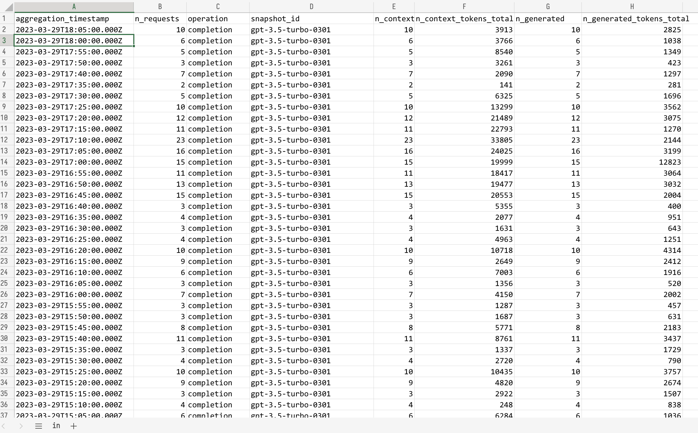
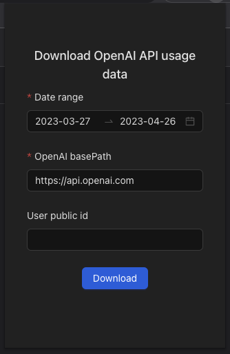

# OpenAI API Usage Data Export

This is a Chrome extension that exports the usage data of the OpenAI API to a CSV file, which can be further analyzed in Excel.

## Usage

1. Install this extension
2. Open and login <https://platform.openai.com/>
3. Click the extension icon
4. Choose a time range and download the CSV file.

